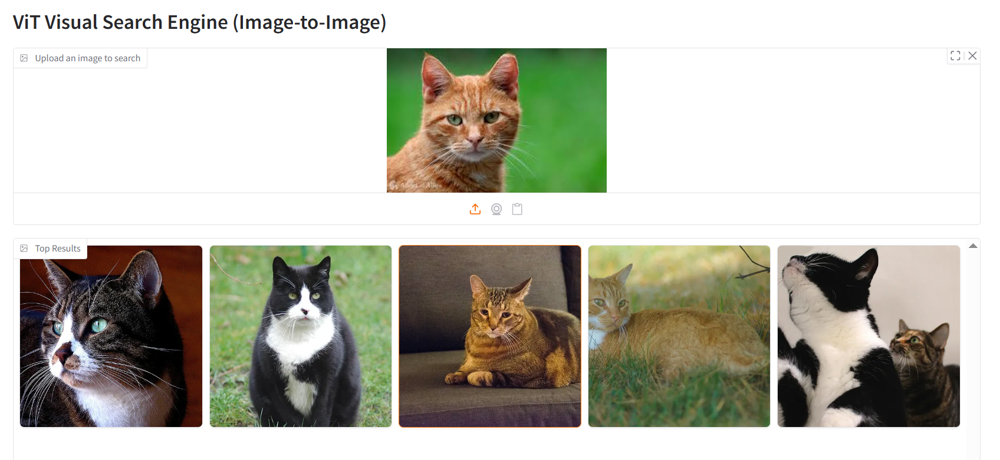

# visual-search-engine
Built a basic image similarity search engine using CLIP/CNN/ViT and FAISS. The retrieved images shared similar semantic meaning with the query, indicating the effectiveness of the approach.

## CLIP-based visual search engine:

To build a visual search engine based on **CLIP**, we first need to convert each image in our collection (specifically, the COCO 2017 dataset in this case) to extract high-dimensional numerical "feature vectors" (embeddings) with CLIP image encoder.

Next, a FAISS index is created from these image embeddings. **FAISS (Facebook AI Similarity Search)** is a specialized library for efficient similarity search and clustering of dense vectors, optimized for rapidly searching through millions or even billions of high-dimensional vectors.

Afterward, each query (whether an image or text) is also converted to an embedding. This query embedding then undergoes L2 normalization. Subsequently, a search is performed within the FAISS index to identify and retrieve the top 5 most similar images corresponding to the query (through inner product).

### In summary:
**Feature Extraction:** Built a robust image feature extractor leveraging the CLIP image encoder.

**Efficient Indexing:** Indexed extracted feature vectors using a FAISS IndexFlatIP for rapid similarity search.

**Similarity Search:** Performed high-performance similarity search to find the most relevant images based on query embeddings.

**Interactive Interface:** Developed a Gradio-based web interface to facilitate intuitive image-to-image search.

###watch a video demo:

The results of image_query as below:

<table style="width:100%;">
  <tr>
    <td style="width:50%; text-align:center;">
      
       
      <em>Top 5 images similar to query image</em>
    </td>
    <td style="width:50%; text-align:center;">
      
       
      <em>Top 5 images similar to query image</em>
    </td>
  </tr>
</table>

Leveraging CLIP's ability to embed both text and images into a shared semantic space, we can develop a search engine that retrieves images based on text queries:

watch a video demo:

The core of our **CNN-based image search engine** involves a pre-trained ResNet50 architecture. To enable its use for feature extraction rather than classification, we remove its terminal fully connected layer, yielding rich image embeddings.

For computational efficiency, especially on GPU hardware, these images are processed in mini-batches during the feature extraction phase, optimizing throughput. 

Next, a **FAISS index** is created from these image features, enabling efficient similarity search. During a query, the inner product between the query image's embedding and the indexed image embeddings is then calculated using the FAISS search() method to find similar images. The Gradio-based demo results are as follow:

<table style="width:100%;">
  <tr>
    <td style="width:50%; text-align:center;">
      
       
      <em>Top 5 images similar to query image</em>
    </td>
    <td style="width:50%; text-align:center;">
      
       
      <em>Top 5 images similar to query image</em>
    </td>
  </tr>
</table>

To develop a **ViT-based visual search engine**, we utilize the same core methodology as in CNN-based and CLIP-based approaches, with the primary difference being the replacement of the feature extractor with a Vision Transformer (ViT) model. The results are as follow:

<table style="width:100%;">
  <tr>
    <td style="width:50%; text-align:center;">
      
       
      <em>Top 5 images similar to query image</em>
    </td>
    <td style="width:50%; text-align:center;">
      
       
      <em>Top 5 images similar to query image</em>
    </td>
  </tr>
</table>

This application is ideal for tasks like content recommendation, reverse image search, anomaly detection in image datasets, or simply exploring visual similarity within your own image libraries.

